= Benchmark Comparison Guide: PortX MuleSoft JDE Connector → Atina JDE Connector
:toc:
:toclevels: 3
:sectnums:
:source-highlighter: rouge

== Purpose and scope

This document helps customers understand:

* What changes (and what does *not* change) when migrating from the PortX (ModusBox) MuleSoft JDE Connector to the Atina JDE Connector.
* A side-by-side performance comparison under the *same* local test conditions.

IMPORTANT: The Atina JDE Connector includes an additional integration option not available in the PortX (ModusBox) connector: *JDE Web Services (BSSV)* invocation.
The Web Services scenarios are included for comparison and context. In real projects, Web Services are often a good fit for *transaction creation* because they encapsulate business rules similarly to interactive applications (pricing, invoicing, sales order logic, etc.).

== Benchmark methodology and environment

=== Test environment

* Client machine: Mac (M4)
* Mule runtime: executed from Anypoint Studio
* Atina Microservice: Docker Desktop
* Test runner: Postman

These results are intended to compare connectors under identical conditions.

IMPORTANT: In a real deployment, the Atina Microservice is typically placed closer (network-wise) to the JDE Enterprise Server / Logic tier, which usually improves overall performance versus this local setup.

=== Warm-up and caching behavior

The first execution cycle often shows higher latency due to warm-up effects (JIT, connection setup, metadata caching, etc.). Subsequent cycles are generally more representative of steady-state behavior.

=== How averages are calculated

* If a run is marked as *Time Out*, it is excluded from the *Average* calculation for that API column.
* If all runs for a given API are Time Out / invalid, the average is shown as *Error*.

== Scenario 01: Get Address Book

=== APIs used

* Web Service:
** `oracle.e1.bssv.JP010000.AddressBookManager.getAddressBook`

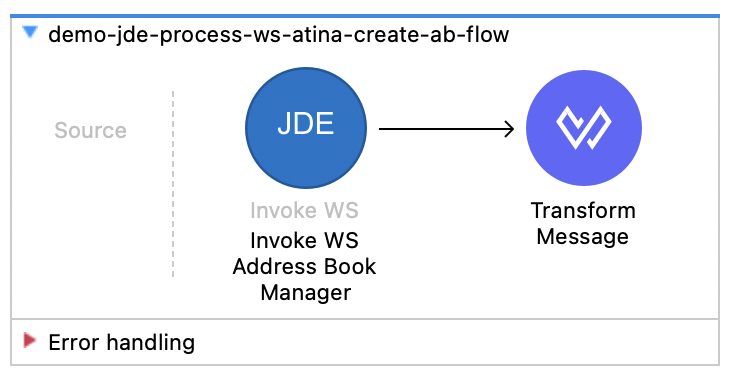
* BSFN (MBF):
** `AddressBookMasterMBF` (Action: *Inquire*) for both Atina and PortX

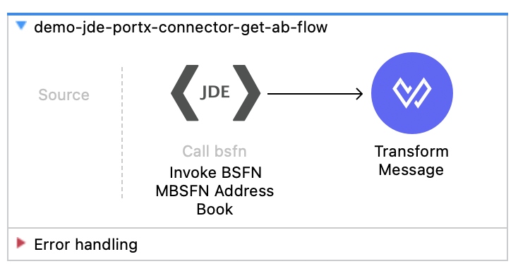
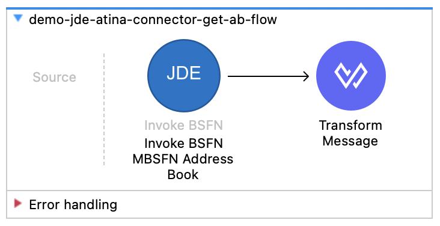

=== Cycle 1

[cols="1,1,1,1",options="header"]
|===
| Execution | Get Address Book Using Web Services (ms) | Get Address Book MBF - Atina (ms) | Get Address Book MBF - PortX (ms)

| Exec 1 | 48822 | 4811 | 58955
| Exec 2 | 19062 | 434  | 540
| Exec 3 | 12887 | 414  | 533
| *Average (ms)* | *26923.67* | *1886.33* | *20009.33*
|===

=== Cycle 2

[cols="1,1,1,1",options="header"]
|===
| Execution | Get Address Book Using Web Services (ms) | Get Address Book MBF - Atina (ms) | Get Address Book MBF - PortX (ms)

| Exec 1  | 13856 | 706 | 638
| Exec 2  | 11291 | 444 | 704
| Exec 3  | 13756 | 376 | 584
| Exec 4  | 13830 | 419 | 640
| Exec 5  | 11059 | 401 | 577
| Exec 6  | 18287 | 421 | 582
| Exec 7  | 25588 | 428 | 4925
| Exec 8  | 11010 | 469 | 610
| Exec 9  | 13050 | 417 | 582
| Exec 10 | 11099 | 411 | 621

| *Average (ms)* | *14282.60* | *449.20* | *1046.30*
|===

== Scenario 02: Create Address Book

=== APIs used

* Web Service:
** `oracle.e1.bssv.JP010020.CustomerManager.processCustomer`

* BSFN (MBF):
** `AddressBookMasterMBF` (Action: *Add*) for both Atina and PortX

=== Cycle 1

[cols="1,1,1,1",options="header"]
|===
| Execution | Create AB WS (ms) | Create AB BSFN - Atina (ms) | Create AB BSFN - PortX (ms)

| Exec 1 | 28594 | 1497 | 12973
| Exec 2 | 5585  | 522  | 631
| Exec 3 | 5472  | 5152 | 628

| *Average (ms)* | *13217.00* | *2390.33* | *4744.00*
|===

=== Cycle 2

[cols="1,1,1,1",options="header"]
|===
| Execution | Create AB Using Web Services (ms) | Create AB Using BSFN - Atina (ms) | Create AB Using BSFN - PortX (ms)

|Exec 1  |13207 |526 |4981
|Exec 2  |5529  |501 |706
|Exec 3  |9947  |531 |639
|Exec 4  |5403  |481 |618
|Exec 5  |5733  |498 |707
|Exec 6  |13037 |523 |5106
|Exec 7  |5543  |481 |620
|Exec 8  |5381  |535 |614
|Exec 9  |5475  |480 |661
|Exec 10 |5464  |456 |627

|Average (ms) |7471.9 |501.2 |1527.9
|===

== Scenario 03: Delete Address Book

=== APIs used

* BSFN (MBF):
** `AddressBookMasterMBF` (Action: *Delete*) for both Atina and PortX

image::images/B01.png[width=400,align=center]
image::images/B02.png[width=400,align=center]

=== Cycle 1

[cols="1,1,1",options="header"]
|===
| Execution | Delete AB Using BSFN - Atina (ms) | Delete AB Using BSFN - PortX (ms)
| Exec 1 | 1297 | 1466
| Exec 2 | 656  | 747
| Exec 3 | 622  | 1362
| *Average (ms)* | *858.33* | *1191.67*
|===

=== Cycle 2

NOTE: This cycle contains *two* Atina delete runs (different executions/records). They are shown separately.

[cols="1,1,1,1",options="header"]
|===
| Execution | Delete AB Using BSFN - Atina (Run A) (ms) | Delete AB Using BSFN - Atina (Run B) (ms) | Delete AB Using BSFN - PortX (ms)
| Exec 1  | 592  | 641 | 1293
| Exec 2  | 7414 | 675 | 743
| Exec 3  | 668  | 660 | 725
| Exec 4  | 635  | 617 | 726
| Exec 5  | 620  | 577 | 790
| Exec 6  | 637  | 583 | 714
| Exec 7  | 631  | 625 | 727
| Exec 8  | 656  | 552 | 746
| Exec 9  | 629  | 567 | 708
| Exec 10 | 579  | 586 | 753
| *Average (ms)* | *1306.10* | *608.30* | *792.50*
|===

== Scenario 04: Get Customer

=== APIs used

* Web Service:
** `oracle.e1.bssv.JP010020.CustomerManager.getCustomerV3`

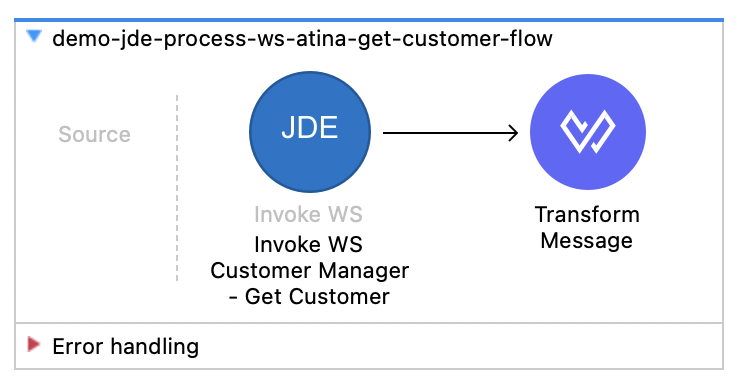
* BSFNs:
** `MBFCustomerMaster` + `AddressBookMasterMBF` (Action: *Inquire*) for both Atina and PortX

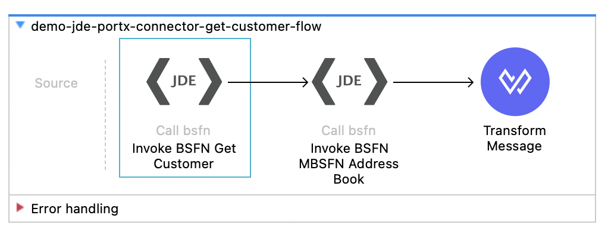
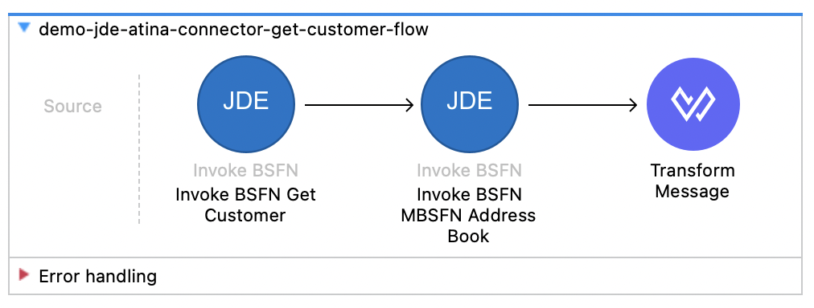

=== Cycle 1

[cols="1,1,1,1",options="header"]
|===
| Execution | Get CUSTOMER WS (ms) | Get CUSTOMER BSFN - Atina (ms) | Get CUSTOMER BSFN - PortX (ms)
| Exec 1 | 59452 | 995  | Time Out
| Exec 2 | 18825 | 5438 | 16212
| Exec 3 | 35719 | 859  | 5413
| *Average (ms)* | *37998.67* | *2430.67* | *10812.50*
|===

NOTE: Averages are calculated excluding the execution marked as Time Out.

=== Cycle 2

[cols="1,1,1,1",options="header"]
|===
| Execution | Get CUSTOMER WS (ms) | Get CUSTOMER BSFN - Atina (ms) | Get CUSTOMER BSFN - PortX (ms)
| Exec 1  | 39874 | 866 | 9941
| Exec 2  | 18538 | 818 | 1142
| Exec 3  | 16983 | 856 | 1135
| Exec 4  | 16446 | 849 | 1118
| Exec 5  | 18420 | 817 | 1118
| Exec 6  | 17300 | 883 | 1168
| Exec 7  | 18397 | 859 | 1125
| Exec 8  | 16480 | 862 | 1162
| Exec 9  | 18505 | 855 | 1108
| Exec 10 | 20067 | 858 | 1162
| *Average (ms)* | *20101.00* | *852.30* | *2017.90*
|===

== Scenario 05: Create Customer

=== APIs used

* Web Service:
** `oracle.e1.bssv.JP010020.CustomerManager.processCustomer`

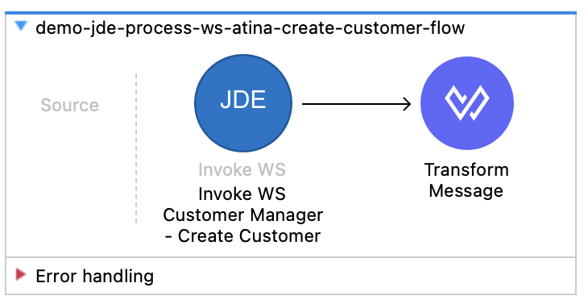

* BSFNs:
** `MBFCustomerMaster` + `AddressBookMasterMBF` (Action: *Add*) for both Atina and PortX

image::images/D02.png[width=400,align=center]
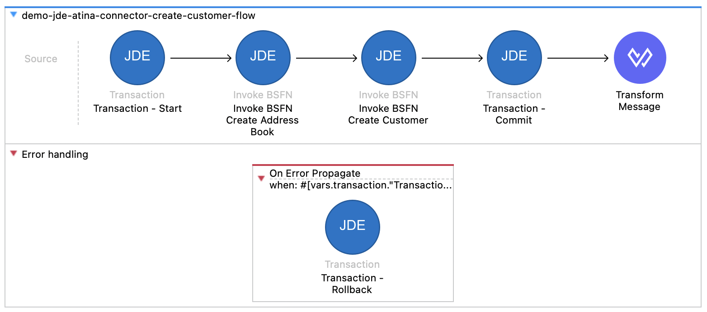

=== Cycle 1

[cols="1,1,1,1",options="header"]
|===
| Execution | Create CUSTOMER WS (ms) | Create CUSTOMER BSFN - Atina (ms) | Create CUSTOMER BSFN - PortX (ms)

| Exec 1 | 30484 | 3445 | 14928
| Exec 2 | 13346 | 1956 | Time Out

| *Average (ms)* | *21915.00* | *2700.50* | *14928.00*
|===

NOTE: Averages are calculated excluding the execution marked as Time Out.

=== Cycle 2

[cols="1,1,1,1",options="header"]
|===
| Execution | Create CUSTOMER WS (ms) | Create CUSTOMER BSFN - Atina (ms) | Create CUSTOMER BSFN - PortX (ms)

| Exec 1  | 27399 | 2020 | 17058
| Exec 2  | 4980  | 1946 | 1464
| Exec 3  | 6837  | 1986 | 1405
| Exec 4  | 4999  | 1943 | 1440
| Exec 5  | 6905  | 2022 | 1435
| Exec 6  | 4976  | 1929 | 1468
| Exec 7  | 4882  | 1963 | 1355
| Exec 8  | 6909  | 1983 | 1375
| Exec 9  | 5011  | 1919 | 1378
| Exec 10 | 42296 | 2912 | 11381

| *Average (ms)* | *11519.40* | *2062.30* | *3975.90*
|===

== Scenario 06: Delete Customer

=== APIs used

* BSFNs:
** `MBFCustomerMaster` + `AddressBookMasterMBF` (Action: *Delete*) for both Atina and PortX

image::images/E01.png[width=400,align=center]
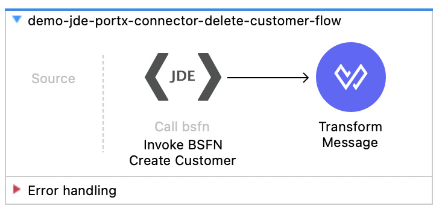

=== Cycle 1

[cols="1,1,1",options="header"]
|===
| Execution | Delete CUSTOMER BSFN - Atina (ms) | Delete CUSTOMER BSFN - PortX (ms)

| Exec 1  | 698 | 1373
| Exec 2  | 755 | 884
| Exec 3  | 742 | 835
| Exec 4  | 748 | 898
| Exec 5  | 693 | 954
| Exec 6  | 721 | 865
| Exec 7  | 676 | 872
| Exec 8  | 735 | 851
| Exec 9  | 691 | 1100
| Exec 10 | 779 | 872
| *Average (ms)* | *723.80* | *950.40*
|===

== Scenario 07: Create Sales Order

=== APIs used

* Web Service:
** `oracle.e1.bssv.JP420000.SalesOrderManager.processSalesOrder`

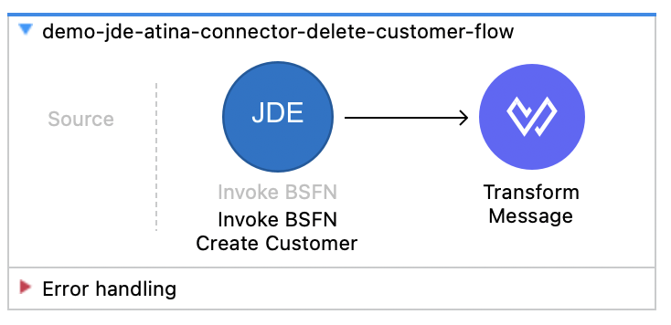

* BSFNs (Transaction Processing):
** `F4211FSBeginDoc`
** `F4211FSEditLine` (per line)
** `F4211FSEndDoc`
** `F4211ClearWorkFile`

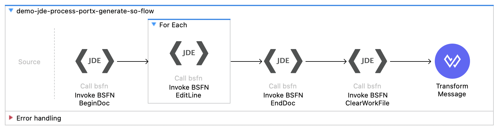
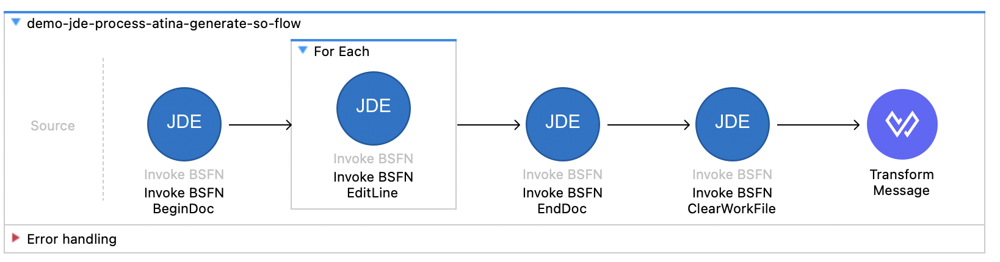

=== Cycle 1

[cols="1,1,1,1",options="header"]
|===
| Execution | Create Sales Order WS (ms) | Create Sales Order BSFN - Atina (ms) | Create Sales Order BSFN - PortX (ms)

| Exec 1  | 268003 | 12223 | 135443
| Exec 2  | 87591  | 2625  | 2602
| Exec 3  | 33132  | 2674  | 2495

| *Average (ms)* | *129575.30* | *5840.70* | *46846.70*
|===

=== Cycle 2

[cols="1,1,1,1",options="header"]
|===
| Execution | Create Sales Order WS (ms) | Create Sales Order BSFN - Atina (ms) | Create Sales Order BSFN - PortX (ms)

| Exec 1  | 44898 | 2582 | Time Out
| Exec 2  | 31803 | 6168 | 3216
| Exec 3  | 41434 | 2525 | 8953
| Exec 4  | 35334 | 2621 | 9438
| Exec 5  | 31830 | 2498 | 2477
| Exec 6  | 32281 | 2605 | 2496
| Exec 7  | 40250 | 2511 | 2452
| Exec 8  | 34137 | 2449 | 2696
| Exec 9  | 36355 | 2725 | 9384
| Exec 10 | 31880 | 2525 | 2485

| *Average (ms)* | *36020.20* | *2920.90* | *4844.10*
|===

NOTE: Averages are calculated excluding the execution marked as Time Out.

== Scenario 08: Submit UBE and retrieve status

This process submits a UBE and retrieves its status.
In these runs, PortX is slightly faster than Atina.

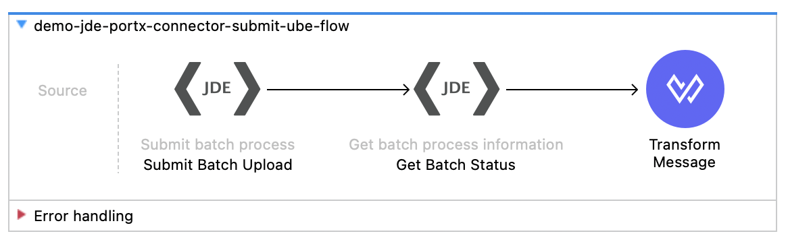
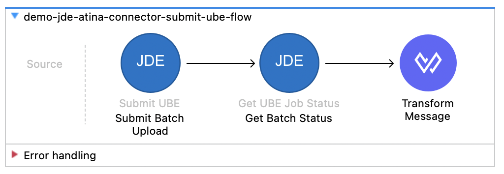

=== Cycle 1

[cols="1,1,1",options="header"]
|===
| Execution | Submit UBE - Atina (ms) | Submit UBE - PortX (ms)

| Exec 1  | 5559 | 1843
| Exec 2  | 2083 | 1791
| Exec 3  | 1993 | 1783

| *Average (ms)* | *3211.70* | *1805.70*
|===

=== Cycle 2

[cols="1,1,1",options="header"]
|===
| Execution | Submit UBE - Atina (ms) | Submit UBE - PortX (ms)

| Exec 1  | 6441 | 1791
| Exec 2  | 2010 | 1804
| Exec 3  | 1972 | 1732
| Exec 4  | 1917 | 1819
| Exec 5  | 2029 | 1818
| Exec 6  | 1934 | 1785
| Exec 7  | 2077 | 1838
| Exec 8  | 1871 | 1718
| Exec 9  | 1971 | 1808
| Exec 10 | 2099 | 1784

| *Average (ms)* | *2432.10* | *1789.90*
|===

== Scenario 09: Get Events (MBF Events)

This scenario retrieves customer-created events (2 records per request in these tests).

image::images/H01.png[width=400,align=center]
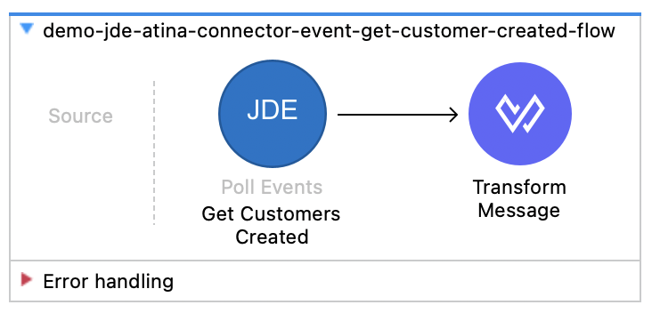

=== Cycle 1

[cols="1,1,1",options="header"]
|===
| Execution | Get Events - Atina (ms) | Get Events - PortX (ms)

| Exec 1  | 9827 | Time Out
| Exec 2  | 3116 | 4717
| Exec 3  | 3152 | 2946

| *Average (ms)* | *5365.00* | *3831.50*
|===

NOTE: Averages are calculated excluding the execution marked as Time Out.

=== Cycle 2

[cols="1,1,1",options="header"]
|===
| Execution | Get Events - Atina (ms) | Get Events - PortX (ms)

| Exec 1  | 3079 | Time Out
| Exec 2  | 3230 | 4000
| Exec 3  | 3146 | 2951
| Exec 4  | 3036 | 3051
| Exec 5  | 3135 | 3050
| Exec 6  | 3166 | 3016
| Exec 7  | 3142 | 3054
| Exec 8  | 3055 | 3011
| Exec 9  | 3068 | 2866
| Exec 10 | 3046 | 2946

| *Average (ms)* | *3110.30* | *3105.00*
|===

NOTE: Averages are calculated excluding the execution marked as Time Out.

== Summary: Which connector performs better?

The table below summarizes steady-state performance (Cycle 2 where available). Lower is better. Averages are computed excluding executions marked as Time Out.

[cols=“3,1,1,1,1,3”,options=“header”]
|===
|Scenario |Atina Avg (ms) |PortX Avg (ms) |Winner |Speedup |Notes

|Get Address Book (MBF – Inquire)
|449.2 |1046.3 |Atina |2.33x |Cycle 2

|Create Address Book (MBF – Add)
|501.2 |1527.9 |Atina |3.05x |Cycle 2; PortX run includes a couple of ~5s outlier latencies

|Delete Address Book (MBF – Delete)
|608.3 |792.5 |Atina |1.30x |Cycle 2 (using the Atina average without the extreme outlier)

|Get Customer (MBF + AB – Inquire)
|852.3 |2017.9 |Atina |2.37x |Cycle 2

|Create Customer (MBF + AB – Add)
|2062.3 |3975.9 |Atina |1.93x |Cycle 2

|Delete Customer (MBF + AB – Delete)
|723.8 |950.4 |Atina |1.31x |One cycle available

|Create Sales Order (BSFN Transaction Processing)
|2920.9 |4844.1 |Atina |1.66x |Cycle 2; PortX Exec 1 timed out and was excluded

|Submit UBE
|2432.1 |1789.7 |PortX |1.36x |Cycle 2

|Get Events
|3110.3 |3105.0 |Tie |~1.00x |Cycle 2; PortX Exec 1 timed out and was excluded; remaining averages are essentially identical
|===
|Average (ms) |7471.9 |501.2 |1527.9
Overall outcome: Atina is faster in most operations tested; PortX is faster in Submit UBE; Get Events is effectively a tie.