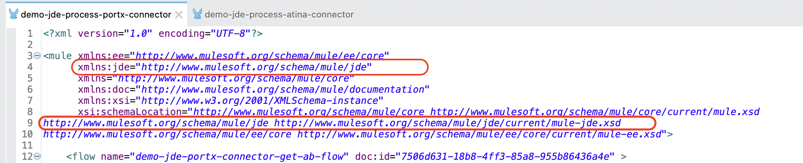
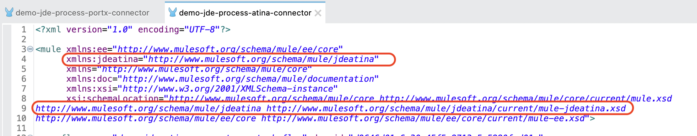
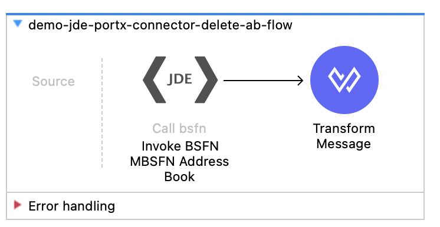
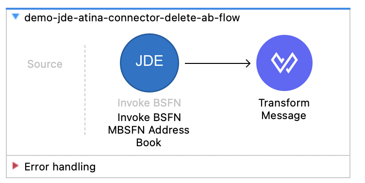
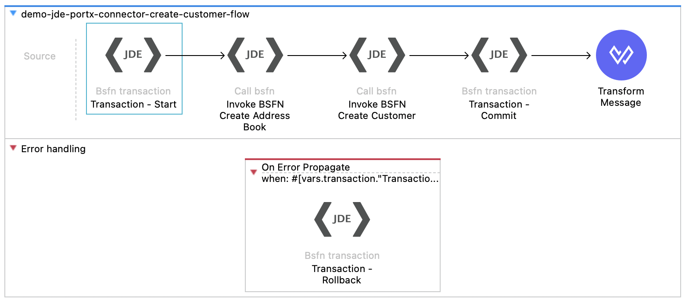
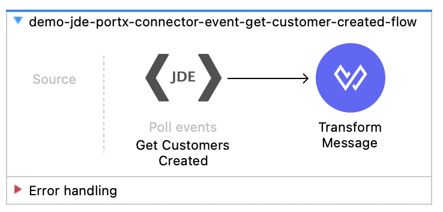

= Migration Guide: PortX MuleSoft JDE Connector → Atina JDE Connector
:toc:
:toclevels: 3
:sectnums:
:source-highlighter: rouge

== Purpose and scope

This guide describes how to migrate Mule application flows that currently use the *PortX MuleSoft JDE Connector* to the *Atina JDE Connector*.
It focuses on the XML and operation-level changes required in Mule configuration files (e.g., `*.xml` flows).

It does *not* cover functional changes in JD Edwards itself. Your existing BSFN/UBE/event logic and DataWeave payloads can typically be reused with minimal or no changes, once the Mule XML components are updated.

== Audience

* MuleSoft developers / integration engineers
* Solution architects responsible for upgrading connector dependencies and validating end-to-end regression tests

== Before you start

* Create a migration branch (or a full backup) of your Mule project.
* Ensure you have the Atina connector available in your Anypoint/Studio environment (or added as a project dependency).
* Identify all Mule XML files that include PortX JDE components (look for `xmlns:jde="http://www.mulesoft.org/schema/mule/jde"` or `<jde:` tags).

== High-level migration summary

Migration consists of three main actions:

. Update the Mule XML *namespace* and *schemaLocation* from `jde` to `jdeatina`.
. Replace PortX operation components (e.g., `<jde:call-bsfn>`) with their Atina equivalents (e.g., `<jdeatina:invoke-bsfn>`), including any attribute name changes.
. Update `config-ref` values if your connector configuration name differs between the old and new projects.

== 1. Update the Mule XML header (namespaces and schema location)

In each Mule XML file that uses the *PortX MuleSoft JDE Connector*:

=== 1.1 Replace the namespace prefix

*PortX (old):*
[source,xml]
----
xmlns:jde="http://www.mulesoft.org/schema/mule/jde"
----

*Atina (new):*
[source,xml]
----
xmlns:jdeatina="http://www.mulesoft.org/schema/mule/jdeatina"
----

=== 1.2 Replace the schemaLocation entry

*PortX (old):*
[source,xml]
----
http://www.mulesoft.org/schema/mule/jde http://www.mulesoft.org/schema/mule/jde/current/mule-jde.xsd
----

*Atina (new):*
[source,xml]
----
http://www.mulesoft.org/schema/mule/jdeatina http://www.mulesoft.org/schema/mule/jdeatina/current/mule-jdeatina.xsd
----

== 2. Migrate operations (components) and attributes

=== Call/Invoke BSFN

*PortX (old):*

[source,xml]
----
<jde:call-bsfn doc:name="Invoke BSFN Address Book" config-ref="JDE_Config" bsfnName="AddressBookMasterMBF">
  <jde:input-parameters><![CDATA[#[output application/json
---
{
  cActionCode: "I",
  cSuppressErrorMessages: "1",
  szVersion: "ZJDE0001",
  mnAddressBookNumber: attributes.queryParams.entityID as Number
}]]]>
  </jde:input-parameters>
</jde:call-bsfn>
----

*Atina (new):*

[source,xml]
----
<jdeatina:invoke-bsfn doc:name="Invoke BSFN Address Book" config-ref="JDE_Atina_Config_Non_WS_Operation" wsName="AddressBookMasterMBF">
  <jdeatina:input-parameters><![CDATA[#[output application/json
---
{
  cActionCode: "I",
  cSuppressErrorMessages: "1",
  szVersion: "ZJDE0001",
  mnAddressBookNumber: attributes.queryParams.entityID as Number
}]]]>
  </jdeatina:input-parameters>
</jdeatina:invoke-bsfn>
----

==== Change Summary — Call/Invoke BSFN (PortX → Atina)

* *Component*
** `jde:call-bsfn` → `jdeatina:invoke-bsfn`

* *BSFN name attribute*
** `bsfnName="..."` → `wsName="..."`

* *Input parameters tag*
** `jde:input-parameters` → `jdeatina:input-parameters`
** The DataWeave content inside CDATA usually remains the same (same payload structure), but may require adjustments for specific fields.

* *Connector configuration reference (`config-ref`)*
** May change depending on your naming convention:
*** PortX example: `config-ref="JDE_Config"`
*** Atina example: `config-ref="JDE_Atina_Config_Non_WS_Operation"`

* *Important note (date fields)*
** The DataWeave payload inside CDATA may require changes for date-like fields.
** See <<migrating-date-fields,Appendix: Migrating Date Fields>>.

=== BSFN Transactions (Start/Commit/Rollback)

*PortX (old):*

==== Start Transaction

[source,xml]
----
<jde:bsfn-transaction
    operation="Start Transaction"
    config-ref="JDE_Config">
  <jde:input-parameters><![CDATA[#[output application/java
---
{}]]]>
  </jde:input-parameters>
</jde:bsfn-transaction>
----

==== Commit Transaction

[source,xml]
----
<jde:bsfn-transaction
    operation="Commit Transaction"
    doc:name="Transaction - Commit"
    config-ref="JDE_Config">
    <jde:input-parameters><![CDATA[#[output application/java
---
{
	"Transaction ID": vars.transaction."Transaction ID"
}]]]></jde:input-parameters>
</jde:bsfn-transaction>
----
==== Rollback Transaction

[source,xml]
----
<jde:bsfn-transaction
    operation="Rollback Transaction"
    doc:name="Transaction - Rollback"
    config-ref="JDE_Config">
    <jde:input-parameters><![CDATA[#[output application/java
---
{
	"Transaction ID": vars.transaction."Transaction ID"
}]]]></jde:input-parameters>
</jde:bsfn-transaction>
----

*Atina (new):*

==== Start Transaction

[source,xml]
----
<jdeatina:transaction
    transactionOperation="Start Transaction"
    doc:name="Transaction - Start"
    config-ref="JDE_Atina_Config_Non_WS_Operation">
    <jdeatina:input-parameters><![CDATA[#[output application/java
---
{
}]]]></jdeatina:input-parameters>
</jdeatina:transaction>
----

==== Commit Transaction

[source,xml]
----
<jdeatina:transaction
    transactionOperation="Commit Transaction"
    doc:name="Transaction - Commit"
    config-ref="JDE_Atina_Config_Non_WS_Operation">
<jdeatina:input-parameters><![CDATA[#[output application/java
---
{
	"Transaction ID": vars.transaction."Transaction ID"
}]]]></jdeatina:input-parameters>
</jdeatina:transaction>
----
==== Rollback Transaction

[source,xml]
----
<jdeatina:transaction
    transactionOperation="Rollback Transaction"
    doc:name="Transaction - Rollback"
    config-ref="JDE_Atina_Config_Non_WS_Operation">
    <jdeatina:input-parameters><![CDATA[#[output application/java
---
{
	"Transaction ID": vars.transaction."Transaction ID"
}]]]></jdeatina:input-parameters>
</jdeatina:transaction>
----

==== Change Summary — BSFN Transactions (Start / Commit / Rollback) (PortX → Atina)

* *Component*
** `jde:bsfn-transaction` → `jdeatina:transaction`

* *Operation attribute*
** `operation="Start Transaction|Commit Transaction|Rollback Transaction"` →
`transactionOperation="Start Transaction|Commit Transaction|Rollback Transaction"`

* *Input parameters tag*
** `jde:input-parameters` → `jdeatina:input-parameters`
** The DataWeave payload typically remains the same. For Commit/Rollback you still pass:
*** `"Transaction ID": vars.transaction."Transaction ID"`

* *Connector configuration reference (`config-ref`)*
** May change depending on your naming convention:
*** PortX example: `config-ref="JDE_Config"`
*** Atina example: `config-ref="JDE_Atina_Config_Non_WS_Operation"`

* *Transaction flow reminder*
** Start returns a transaction object (store it in a variable, e.g. `vars.transaction`)
** Commit/Rollback must reuse the same `"Transaction ID"` value from the Start response

===  Submit UBE (Batch Process)

*PortX (old):*

image::images/D01.png[width=600,align=center]

[source,xml]
----
<jde:submit-batch-process
    ubeName="R01010Z-ZJDE0001"
    doc:name="Submit Batch Upload"
    config-ref="JDE_Config" >
    <jde:input-parameters ><![CDATA[#[output application/json
---
{
	"Report Interconnect": {
		szEdiUserIdData: 'ALA'
	},
	"Data Selection": "F0101Z2.EDUS = '" ++ (payload.DataSelection_EDUS as String) ++ "' AND F0101Z2.EDTN>'001'"
}]]]></jde:input-parameters>
</jde:submit-batch-process>
----

*Atina (new):*

image::images/D01.png[width=600,align=center]

[source,xml]
----
<jdeatina:submit-batch-process
    ubeName="R01010Z-ZJDE0001"
    config-ref="JDE_Atina_Config_Non_WS_Operation">
    <jdeatina:input-parameters ><![CDATA[#[output application/json
---
{
	"Report Interconnect": {
		szEdiUserIdData: 'ALA'
	},
	"Processing Options": {
		cProofFinalFlag: payload.PO_ProcessMode
	},
	"Data Selection": "F0101Z2.EDUS = '" ++ (payload.DataSelection_EDUS as String) ++ "' AND F0101Z2.EDTN>'001'"
}]]]></jdeatina:input-parameters>
</jdeatina:submit-batch-process>
----

==== Change Summary — Submit UBE (Batch Process) (PortX → Atina)

* *Component*
** Same operation name, different prefix:
*** `jde:submit-batch-process` → `jdeatina:submit-batch-process`

* *UBE name attribute*
** `ubeName="..."` remains the same (for example: `R01010Z-ZJDE0001`)

* *Input parameters tag*
** `jde:input-parameters` → `jdeatina:input-parameters`
** The DataWeave payload structure can usually be reused.

* *Payload differences (common in migrations)*
** Atina examples often include an explicit `Processing Options` section (if your UBE requires it), e.g.:
*** `"Processing Options": { cProofFinalFlag: payload.PO_ProcessMode }`
** Keep your existing `Report Interconnect` and `Data Selection` logic as-is unless your UBE expects different keys.

* *Connector configuration reference (`config-ref`)*
** May change depending on your naming convention:
*** PortX example: `config-ref="JDE_Config"`
*** Atina example: `config-ref="JDE_Atina_Config_Non_WS_Operation"`

=== Batch Process Information (Job Status)

*PortX (old):*

image::images/D01.png[width=600,align=center]

[source,xml]
----
<jde:get-batch-process-information
    ubeName="Get Job Status"
    doc:name="Get Batch Status"
    config-ref="JDE_Config">
    <jde:input-parameters ><![CDATA[#[output application/java
---
{
	"Job_ID": vars.ubeSubmited."_Job_ID" as String
}]]]></jde:input-parameters>
</jde:get-batch-process-information>
----

*Atina (new):*

image::images/D02.png[width=600,align=center]

[source,xml]
----
<jdeatina:get-batch-process-information
    operation="Get Job Status"
    doc:name="Get Batch Status"
    config-ref="JDE_Atina_Config_Non_WS_Operation">
    <jdeatina:input-parameters ><![CDATA[#[output application/java
---
{
	"JOB Number": vars.ubeSubmited."JOB Number" as String
}]]]></jdeatina:input-parameters>
</jdeatina:get-batch-process-information>
----

==== Change Summary — Batch Process Information (Get Job Status) (PortX → Atina)

* *Component*
** `jde:get-batch-process-information` → `jdeatina:get-batch-process-information`

* *Operation attribute*
** PortX uses `ubeName="Get Job Status"`
** Atina uses `operation="Get Job Status"`
** Migration: `ubeName` → `operation`

* *Input parameters tag*
** `jde:input-parameters` → `jdeatina:input-parameters`

* *Input payload key differences (verify in your flows)*
** PortX example passes:
*** `"Job_ID": vars.ubeSubmited."_Job_ID" as String`
** Atina example passes:
*** `"JOB Number": vars.ubeSubmited."JOB Number" as String`
** Ensure the variable name and key match the actual output returned by your *Submit UBE* step in each connector version.

* *Connector configuration reference (`config-ref`)*
** May change depending on your naming convention:
*** PortX example: `config-ref="JDE_Config"`
*** Atina example: `config-ref="JDE_Atina_Config_Non_WS_Operation"`

=== Poll Events

*PortX (old):*

[source,xml]
----
<jde:poll-events
    operation="Capture Event Transactions"
    doc:name="Get Customers Created"
    config-ref="JDE_Config">
    <jde:input-parameters ><![CDATA[#[output application/java
---
{
	"Transaction Code": 'JDECM',
	"Last Batch Number (EDBT)": '',
	"Max Qty Transactions to Read": attributes.queryParams.qtyRecords,
	"Lock Events": 'N',
	"Update Events": 'N',
	"Match Interop Line Number": false
}]]]></jde:input-parameters>
</jde:poll-events>
----

*Atina (new):*

image::images/E02.png[width=600,align=center]

[source,xml]
----
<jdeatina:poll-events
    operation="Capture Event Transactions"
    doc:name="Get Customers Created"
    config-ref="JDE_Atina_Config_Non_WS_Operation">
    <jdeatina:input-parameters ><![CDATA[#[output application/java
---
{
	"Transaction Code": 'JDECM',
	"Last Batch Number (EDBT)": '',
	"Max Qty Transactions to Read": attributes.queryParams.qtyRecords,
	"Lock Events": 'N',
	"Update Events": 'N',
	"Match Interop Line Number": false
}]]]></jdeatina:input-parameters>
</jdeatina:poll-events>
----

==== Change Summary — Poll Events (PortX → Atina)

* *Component*
** Same operation name, different prefix:
*** `jde:poll-events` → `jdeatina:poll-events`

* *Operation attribute*
** `operation="Capture Event Transactions"` remains the same

* *Input parameters tag*
** `jde:input-parameters` → `jdeatina:input-parameters`
** The DataWeave payload can usually be reused without changes.

* *Connector configuration reference (`config-ref`)*
** May change depending on your naming convention:
*** PortX example: `config-ref="JDE_Config"`
*** Atina example: `config-ref="JDE_Atina_Config_Non_WS_Operation"`

== Connector configuration (`config-ref`) alignment

In the provided examples, the PortX flows reference `config-ref="JDE_Config"`, while the Atina flows reference `config-ref="JDE_Atina_Config_Non_WS_Operation"`.

You can migrate in either of these ways:

*Option A — keep your existing name:* Create the Atina connector configuration with the same name (`JDE_Config`) so flows require minimal edits (only prefix/component changes).

*Option B — adopt a new name:* Rename all `config-ref` usages to the Atina config name you want to standardize on (e.g., `JDE_Atina_Config_Non_WS_Operation`).

Recommendation: choose one convention and apply it consistently across all flows to avoid confusion and mixed configurations.

== Validation and regression testing

After migrating:

* Validate the project compiles and Studio recognizes the new schema (no red XML errors).
* Run “Test Connection” (where applicable) on the Atina config.
* Execute a minimal end-to-end test suite:
  ** BSFN “simple” (read/create/delete)
  ** BSFN “transactional” flows (start → invoke → commit/rollback)
  ** UBE submission + status poll
  ** Event polling (no update/lock first; then test update/lock behavior if used in production)

== Appendix A: Files used as reference

The examples above were derived from these two equivalent demo flows (PortX vs Atina):

* `demo-jde-process-portx-connector.xml`
* `demo-jde-process-atina-connector.xml`

[[migrating-date-fields]]
== Migrating Date Fields in BSFN Inputs

When migrating BSFN calls from the *PortX JDE Connector* to the *Atina JDE Connector*, pay special attention to *date fields*.

Atina accepts more date representations than PortX, but *date values must still be migrated* to a compatible representation (do not keep legacy string formats such as `dd/MM/yyyy` unconverted).

=== Why this changes

* *PortX* commonly requires Java date objects (for example `java.time.LocalDate`) created inside DataWeave, often using `output application/java`.
* *Atina* can accept DataWeave-native `Date` / `DateTime` values serialized to JSON and ISO-8601 representations (date-only or full timestamps with timezone offsets).

=== Migration rule of thumb

Replace Java `LocalDate` parsing/creation with DataWeave-native date handling.

If the source payload provides dates as strings (for example `dd/MM/yyyy`), normalize them before invoking the Atina BSFN:

* Convert to a DW `Date` / `DateTime`, or
* Convert to an ISO-8601 string (for example `yyyy-MM-dd`)

=== Example 1: `jdRequestedDate` and `jdOrderDate`

==== PortX version (Java `LocalDate`)

[source,xml]
----
<jde:call-bsfn bsfnName="F4211FSBeginDoc" doc:name="Invoke BSFN BeginDoc" doc:id="0bdd30f4-466e-4b00-bf15-71127a75a721" config-ref="JDE_Config" target="BeginDoc">
  <jde:input-parameters><![CDATA[#[%dw 2.0
import java!java::time::LocalDate
import java!java::time::format::DateTimeFormatter
output application/java
var fmt = DateTimeFormatter::ofPattern("dd/MM/yyyy")
---
{
  cCMDocAction: 'A',
  cCMProcessEdits: '1',
  szCMComputerID: 'ATINA',
  cCMUpdateWriteToWF: '2',
  szCMProgramID: 'CORBA',
  szCMVersion: 'ZJDE0001',
  szOrderCo: '00001',
  szOrderType: 'SO',
  szBusinessUnit: '          30',
  mnAddressNumber: payload.deliverTo,
  jdRequestedDate: LocalDate::parse(payload.dateRequested as String, fmt),
  jdOrderDate: LocalDate::now(),
  szReference: 'Atina Reference',
  cMode: 'F',
  szUserID: 'JDE',
  cRetrieveOrderNo: '1'
}]]]></jde:input-parameters>
</jde:call-bsfn>
----

==== Atina version (DataWeave-native dates)

[source,xml]
----
<jdeatina:invoke-bsfn wsName="F4211FSBeginDoc" doc:name="Invoke BSFN BeginDoc" doc:id="b54344cd-68a3-4e53-a1b2-6c1c986d65c7" config-ref="JDE_Atina_Config_Non_WS_Operation" target="BeginDoc">
  <jdeatina:input-parameters><![CDATA[#[output application/json
---
{
  cCMDocAction: 'A',
  cCMProcessEdits: '1',
  szCMComputerID: 'ATINA',
  cCMUpdateWriteToWF: '2',
  szCMProgramID: 'CORBA',
  szCMVersion: 'ZJDE0001',
  szOrderCo: '00001',
  szOrderType: 'SO',
  szBusinessUnit: '          30',
  mnAddressNumber: payload.deliverTo,

  // If payload.dateRequested arrives as "dd/MM/yyyy", normalize it explicitly:
  // jdRequestedDate: (payload.dateRequested as Date { format: "dd/MM/yyyy" }),

  // If payload.dateRequested is already compatible, keep a safe default:
  jdRequestedDate: (payload.dateRequested default (now() as Date { format: "yyyy-MM-dd" })),

  jdOrderDate: now(),
  szReference: 'Atina Reference',
  cMode: 'F',
  szUserID: 'JDE',
  cRetrieveOrderNo: '1'
}]]]></jdeatina:input-parameters>
</jdeatina:invoke-bsfn>
----

=== Example 2: `DateEntered`

==== PortX version (constructing `LocalDate` from `now()`)

[source,xml]
----
<jde:call-bsfn bsfnName="MBFCustomerMaster" doc:name="Invoke BSFN Create Customer" doc:id="9d527832-9d37-4cac-9c81-54c89cc5e78f" config-ref="JDE_Config" target="customerRecord">
  <jde:input-parameters><![CDATA[#[%dw 2.0
import java!java::time::LocalDate
output application/json
var d = now() as Date
---
{
  "Transaction ID": vars.transaction."Transaction ID",
  cActionCode: 'A',
  cUpdateMasterFile: '1',
  szVersion: 'ZJDE00002',
  szCompany: '00000',
  szCurrencyCodeFrom: payload.paymentCurrency,
  szTaxArea1: 'DEN',
  szTaxExplanationCode1: 'S',
  mnAmountCreditLimit: 200000,
  szPaymentTermsAR: '',
  szCurrencyCodeAmounts: payload.paymentCurrency,
  mnAmountHighBalance: 300000,
  cBatchProcessingMode: '',
  mnCustomerNumber: vars.addressBookRecord.mnAddressBookNumber,
  cPersonCorporationCode: '',
  szVersionconsolidated: 'ZJDE00002',
  DateEntered: LocalDate::of(d.year, d.month, d.day)
}]]]></jde:input-parameters>
</jde:call-bsfn>
----

==== Atina version (ISO-8601 date or timestamp)

[source,xml]
----
<jdeatina:invoke-bsfn wsName="MBFCustomerMaster" doc:name="Invoke BSFN Create Customer" doc:id="858f7ade-8187-440e-86c6-dd4cdfdb9f8e" config-ref="JDE_Atina_Config_Non_WS_Operation" target="customerRecord">
  <jdeatina:input-parameters><![CDATA[#[output application/json
---
{
  "Transaction ID": vars.transaction."Transaction ID",
  cActionCode: 'A',
  cUpdateMasterFile: '1',
  szVersion: 'ZJDE00002',
  szCompany: '00000',
  szCurrencyCodeFrom: payload.paymentCurrency,
  szTaxArea1: 'DEN',
  szTaxExplanationCode1: 'S',
  mnAmountCreditLimit: 200000,
  szPaymentTermsAR: '',
  szCurrencyCodeAmounts: payload.paymentCurrency,
  mnAmountHighBalance: 300000,
  cBatchProcessingMode: '',
  mnCustomerNumber: vars.addressBookRecord.mnAddressBookNumber,
  cPersonCorporationCode: '',
  szVersionconsolidated: 'ZJDE00002',

  // Option A (recommended for date-only fields):
  // DateEntered: (now() as Date { format: "yyyy-MM-dd" }),

  // Option B (full timestamp with timezone offset):
  DateEntered: |2025-07-15T14:00:00-03:00|
}]]]></jdeatina:input-parameters>
</jdeatina:invoke-bsfn>
----

=== Recommended formats

To keep migrations consistent, standardize on one of these formats:

* *Date-only (recommended for JD date fields):* `yyyy-MM-dd`
** Example: `(payload.someDate as Date { format: "dd/MM/yyyy" })`
** Example: `(now() as Date { format: "yyyy-MM-dd" })`
* *Date-time with timezone offset* (when time is meaningful):
** Example: `now()`
** Example: `|2025-07-15T14:00:00-03:00|`

=== Migration checklist

* Identify date-like fields (`jd...`, `...Date...`, `DateEntered`, etc.).
* Remove Java `LocalDate` / `DateTimeFormatter` usage unless strictly necessary.
* Normalize legacy string dates (especially `dd/MM/yyyy`) before invoking Atina.
* Prefer DW `Date` / `DateTime` values and/or ISO-8601 representations in the JSON payload.

 
		  

